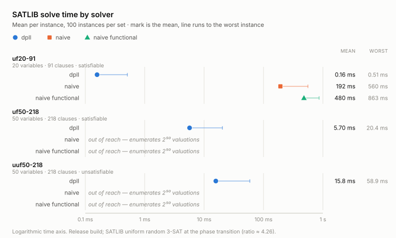

# sat-solver

Implementation of various SAT solving algorithms in Rust,
extracted to and verified in Lean 4 with [hax](https://github.com/hacspec/hax).

The specification — soundness and completeness for both solvers — lives in
[`proofs/lean/SatSolver/Verification/ProofObligations.lean`](proofs/lean/SatSolver/Verification/ProofObligations.lean),
which collects the theorems proved in
[`SatNaive.lean`](proofs/lean/SatSolver/Verification/SatNaive.lean) and
[`SatDpll.lean`](proofs/lean/SatSolver/Verification/SatDpll.lean), the latter of which
rests on the CNF transformation proved correct in
[`Cnf.lean`](proofs/lean/SatSolver/Verification/Cnf.lean).

## Benchmarks

`just satlib` downloads the [SATLIB](https://www.cs.ubc.ca/~hoos/SATLIB/benchm.html)
uniform-random-3-SAT sets into `benchmarks/`; `just satlib-test` runs the solvers over them.

Every `SAT` answer is model-checked with `expr::evaluate`, the way SAT
competitions check solver output — all 3000 verdicts are correct.

<picture>
  <source media="(prefers-color-scheme: dark)" srcset="docs/benchmarks-dark.svg">
  
</picture>

`just satlib-figure` re-measures and prints the dataset as CSV;
[`docs/make_benchmarks_svg.py`](docs/make_benchmarks_svg.py) (stdlib only)
redraws the two SVGs from it.

## Todo

- [ ] **CLI front end** — read a `.cnf` from a path or stdin, print the standard
      `s SATISFIABLE` / `v <model>` lines, exit 10/20/0. Unlocks `hyperfine` and
      any third-party harness.
- [ ] **Differential + property testing** — random formulas checked against the
      (proved-correct) naive solver, plus `proptest`/`cargo fuzz` over the
      parser and `to_cnf`. `sat_dpll.rs` has a small hand-written version of
      this; it should be generative and run on many more instances.
- [ ] **Scaling curve** — `criterion` benchmark sweeping the clause/variable
      ratio through the 4.26 phase transition, naive vs DPLL. This is the plot
      that shows why DPLL exists.
- [ ] **Resolution-hard families** — pigeonhole (`hole-n`) and friends, with a
      timeout. These are exponential for any DPLL-style solver, so they document
      the limit that motivates CDCL. [CNFgen](https://massimolauria.net/cnfgen/)
      generates them (also Tseitin, ordering principle, k-colourability) without
      downloading anything.
- [ ] **DIMACS 1993 challenge suite** — `aim`, `dubois`, `pret`, `ssa`, `bf`,
      `jnh`: small, structured, still cited. A useful second tier beyond random
      3-SAT.

Known limits worth fixing (or at least documenting) alongside the above:

- [x] **`Map` is a linear-scan assoc list.** ~~Every lookup is O(vars).~~ Now a
      slot array indexed by the variable itself (`Vec<Option<bool>>`, grown on
      demand), so `get` and `insert` are both O(1). This is *not* measurable at
      SATLIB sizes — 20–50 slots fit in a cache line either way, and `evaluate`
      short-circuits before doing many lookups — so it was worth doing for the
      asymptotics and for the proofs, not for the benchmark. It removed
      `Map.insert`'s `&mut`-iterator encoding (three nested backward
      continuations) and every `Usize.max` headroom hypothesis in `SatNaive.lean`
      and `SatDpll.lean`: indexing by the key bounds the array by the key type.
- [ ] **DPLL allocates a fresh residual CNF per node.** That is what makes the
      correctness proof clean (each recursive call is self-contained), and it is
      also the performance ceiling. Watched literals would fix it at a
      substantial cost in proof effort.
- [ ] **The verified guarantee doesn't cover benchmark-sized inputs.** The
      soundness/completeness theorems carry `2 ^ exprSize e ≤ Usize.max`, i.e.
      formulas of at most ~63 AST nodes, inherited from the worst-case CNF blowup
      bound in `Cnf.lean`. The code runs fine on a 218-clause instance; the
      theorems say nothing about it. Benchmarking is therefore complementary to
      the proofs, not redundant with them.
- [ ] **No UNSAT proof output.** Competitions require DRAT proofs checked by
      `drat-trim`, because an `UNSAT` answer is otherwise unverifiable. The
      machine-checked completeness theorem is the substitute here — but only
      inside the bound above.
