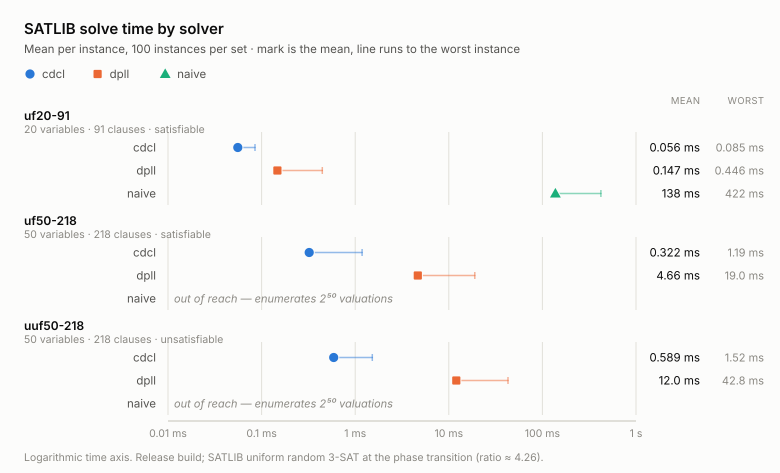

# sat-solver

Implementation of various SAT solving algorithms in Rust,
extracted to and verified in Lean 4 with [hax](https://github.com/hacspec/hax).

Three solvers: `sat_naive` (backtracking search over `Expr`), `sat_dpll` (DPLL
on the CNF: unit propagation plus splitting) and `sat_cdcl` (DPLL plus
conflict-driven clause learning). All three are verified end to end — soundness and
completeness, machine-checked, `sorry`-free. CDCL's proof includes termination of the
search, which is the part that does not follow DPLL's argument.

The specification — soundness and completeness for all three solvers — lives in
[`proofs/lean/SatSolver/Verification/ProofObligations.lean`](proofs/lean/SatSolver/Verification/ProofObligations.lean),
which collects the theorems proved in
[`SatNaive.lean`](proofs/lean/SatSolver/Verification/SatNaive.lean) and
[`SatDpll.lean`](proofs/lean/SatSolver/Verification/SatDpll.lean), the latter of which
rests on the CNF transformations proved correct in
[`Cnf.lean`](proofs/lean/SatSolver/Verification/Cnf.lean) (naive distribution) and
[`Hybrid.lean`](proofs/lean/SatSolver/Verification/Hybrid.lean) (the Boy de la Tour
hybrid, which is what `solve_sat` encodes with by default — `Cnf.lean`'s transformation
is its fallback when gate variables run out).
[`SatCdcl.lean`](proofs/lean/SatSolver/Verification/SatCdcl.lean) does the same for
`sat_cdcl`, through nine theorems: 1-UIP conflict analysis, the four obligations that
establish and preserve the solver's state invariant, the CDCL loop (including its
termination), and the `solve_cnf` pair the roots factor through.

## Benchmarks

`just satlib` downloads the [SATLIB](https://www.cs.ubc.ca/~hoos/SATLIB/benchm.html)
uniform-random-3-SAT sets into `benchmarks/`; `just satlib-test` runs the solvers over them.

Every `SAT` answer is model-checked with `expr::evaluate`, the way SAT
competitions check solver output — all 3000 verdicts are correct for each solver
that can attempt the set.

<picture>
  <source media="(prefers-color-scheme: dark)" srcset="docs/benchmarks-dark.svg">
  
</picture>

`just satlib-figure` re-measures and prints the dataset as CSV;
[`docs/make_benchmarks_svg.py`](docs/make_benchmarks_svg.py) (stdlib only)
redraws the two SVGs from it.

DPLL and CDCL search the *same* CNF (`sat_dpll::encode` under
`Transform::Hybrid`), so the gap between them is the value of clause learning and
nothing else: 2.5x on the 20-variable set, 14x on uf50-218, and 20x on the
unsatisfiable uuf50-218 — most where refuting the formula means exhausting the
search space, which is exactly what learned clauses prune. CDCL manages that
while *rescanning every clause* to propagate; with watched literals the gap would
be wider still.

## Todo

- [ ] **CLI front end** — read a `.cnf` from a path or stdin, print the standard
      `s SATISFIABLE` / `v <model>` lines, exit 10/20/0. Unlocks `hyperfine` and
      any third-party harness.
- [ ] **Differential + property testing** — random formulas checked against the
      (proved-correct) naive solver, plus `proptest`/`cargo fuzz` over the
      parser and `to_cnf`. `sat_dpll.rs` has a small hand-written version of
      this; it should be generative and run on many more instances.
- [ ] **Scaling curve** — `criterion` benchmark sweeping the clause/variable
      ratio through the 4.26 phase transition, naive vs DPLL vs CDCL. This is the
      plot that shows why each of them exists.
- [ ] **Resolution-hard families** — pigeonhole (`hole-n`) and friends, with a
      timeout. These are exponential for any DPLL-style solver, so they document
      the limit that motivates CDCL. [CNFgen](https://massimolauria.net/cnfgen/)
      generates them (also Tseitin, ordering principle, k-colourability) without
      downloading anything.
- [ ] **DIMACS 1993 challenge suite** — `aim`, `dubois`, `pret`, `ssa`, `bf`,
      `jnh`: small, structured, still cited. A useful second tier beyond random
      3-SAT.

Known limits worth fixing (or at least documenting) alongside the above:

- [x] **`Map` is a linear-scan assoc list.** ~~Every lookup is O(vars).~~ Now a
      slot array indexed by the variable itself (`Vec<Option<bool>>`, grown on
      demand), so `get` and `insert` are both O(1). This is *not* measurable at
      SATLIB sizes — 20–50 slots fit in a cache line either way, and `evaluate`
      short-circuits before doing many lookups — so it was worth doing for the
      asymptotics and for the proofs, not for the benchmark. It removed
      `Map.insert`'s `&mut`-iterator encoding (three nested backward
      continuations) and every `Usize.max` headroom hypothesis in `SatNaive.lean`
      and `SatDpll.lean`: indexing by the key bounds the array by the key type.
- [ ] **DPLL allocates a fresh residual CNF per node.** That is what makes the
      correctness proof clean (each recursive call is self-contained), and it is
      also the performance ceiling. Watched literals would fix it at a
      substantial cost in proof effort.
- [ ] **CDCL propagates by rescanning every clause.** Same trade one level up:
      `sat_cdcl::Solver::propagate` is O(clauses) per round where a production
      solver visits only the clauses that could have become unit. It also never
      deletes a learned clause (indices into the clause vector are used as
      `reason` handles) and does not minimize learned clauses. All three are
      engineering, not algorithm — the numbers above are what the algorithm alone
      buys.
- [x] **CDCL is verified.** ~~`sat_cdcl` has one theorem and otherwise tests.~~
      All three solvers now have machine-checked soundness and completeness for the
      whole solver. `sat_cdcl`'s proof is
      [`SatCdcl.lean`](proofs/lean/SatSolver/Verification/SatCdcl.lean): nine
      theorems, `sorry`-free, with `SatSolver/PrintAxioms.lean` asserting that per
      theorem. The tests stay — a 300-instance random 3-SAT differential check
      against the naive solver, and all 3000 SATLIB verdicts — because they cover
      input sizes the theorems do not (see below).

      The hard half of what learning adds is `analyze.spec`: 1-UIP conflict analysis
      returns a clause entailed by the database (resolution soundness — the invariant
      the whole module rests on), false under the current assignment, asserting at the
      backjump level it also returns, and leaves the solver's scratch state exactly as
      it found it. It assumes a well-formed state (`Solver.WF`: the trail is a
      topological order of the implication graph, every propagated literal has a reason
      clause that was unit on it, a level's decision comes first, and so on), and
      `new`, `assign`, `propagate` and `backtrack` are what establish and preserve it.

      The harder half is **`Solver.search.spec`, the CDCL loop itself**: it carries
      `Solver.WF` and "every clause the database holds is entailed by the problem"
      across a loop that *grows* the database, returns a model when it answers `true`,
      refutes the formula when it answers `false`, and **terminates**. DPLL's "one
      variable fewer per level" does not apply. The measure is the trail read as a
      base-3 numeral — one digit per variable slot, `1` for a decision, `2` for a
      propagation — which every step makes larger, a backjump included, since it turns
      the decision it jumps over into a propagation of the clause just learned. Restarts
      abandon the trail; the geometrically growing restart budget is what pays for them.

      **Writing the statements down before proving them is what made this work**, and
      the evidence is what it caught: `Solver.WF` was missing five fields;
      `search.spec` was not a true statement as first written (`self.conflicts += 1` is
      checked `u32` arithmetic, and a first restart interval of `1` never terminates);
      `propagate`'s "nothing is falsified" hypothesis was not inductive; `analyze` never
      said it keeps the activity array's length, without which a *second* call is not
      well-formed. None of that is visible in the finished proofs, and none of it was
      found by reading the code.

      The price is a hypothesis exponential in the number of variables, spelled out in
      the next item rather than hidden.
- [ ] **The verified guarantee doesn't cover benchmark-sized inputs.** Every
      soundness/completeness theorem here carries a size hypothesis, and they are
      the honest limit of what is proved. `sat_naive`/`sat_dpll` carry
      `2 ^ exprSize e ≤ Usize.max` — formulas of at most ~63 AST nodes, inherited
      from the worst-case CNF blowup bound in `Cnf.lean`. `sat_cdcl` carries
      `searchRoom (varBound e) ≤ u32::MAX`, which is much tighter, and is worth
      explaining because it is not slack in the *algorithm*:

      `⦃ ⦄` is total correctness and rules out failure, so proving anything about
      `search` means proving `self.conflicts += 1` — *checked* `u32` arithmetic in
      the extraction — never overflows. That needs a bound on the conflicts still
      to come, and the only such bound available is the termination measure itself,
      which is exponential in the variable count. `searchRoom n = 9^n + 2·3^n` is
      that bound, and `searchRoom n ≤ u32::MAX` holds exactly for `n ≤ 10`. So
      `solve_cnf_{sound,complete}` speak about CNFs of at most ten variables, and at
      the `Expr` layer `varBound e` is (largest variable index + 1) + `exprSize e`,
      which is tighter still. It is the only one of the new hypotheses that binds:
      the clause-count one has a 64-bit `usize` to spend and the clause-length one
      an `i32`, and neither is anywhere near either.

      Some of that is crudeness rather than necessity — `searchRoom` over-approximates
      via `restartsLeft bound budget ≤ bound`, so sharpening it would widen the
      theorem without touching a line of the termination proof. The exponential
      underneath is real, though: a `u32` genuinely cannot count the conflicts of a
      50-variable run.

      Checking the size at *runtime* and bailing out would not help — the bound is a
      predicate on the input alone, so a check relocates it rather than removing it,
      and `None` already means UNSAT, so aborting into it would have the solver call
      a satisfiable formula unsatisfiable. What would help is checking the *counter*:
      `checked_add` at the three increment sites plus a third outcome (`Unknown`).
      Then soundness and "never answers UNSAT for a satisfiable formula" become
      unconditional and cover the benchmarks, "satisfiable ⟹ returns a model" weakens
      to "⟹ a model or `Unknown`", and — the reason it is a genuine trade — the
      base-3 termination argument collapses into counting a `u32` down. Not done.

      So: the code runs fine on a 218-clause instance; the theorems say nothing about
      it. Benchmarking is complementary to the proofs, not redundant with them.
- [ ] **No UNSAT proof output.** Competitions require DRAT proofs checked by
      `drat-trim`, because an `UNSAT` answer is otherwise unverifiable. The
      machine-checked completeness theorem is the substitute here — but only
      inside the bound above.
